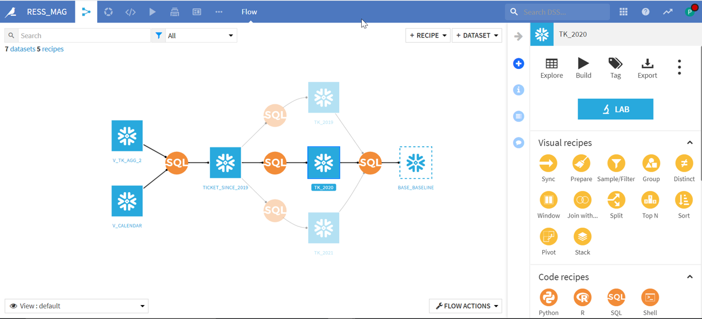

<!-- _class: lead -->

# Dataiku

---
<!-- paginate: true -->

# Ordre du jour
1. Dataiku Online
2. Introduction
3. Dataiku : qu'est-ce que c'est ?
4. A quoi ressemble un projet sur Dataiku ?
5. Démos + pratique
6. Présentation des projets

---
# Dataiku Online
https://www.dataiku.com/company/academic-program/
- A la fin de la page, cherchez "Dataiku Online" et cliquez sur "Get Started"
- Créez un compte

---
# Introduction
Après cette session, vous serez capables de :

- démarrer une session dans Dataiku
- construire un flow de traitement de données
- construire un modèle de régression
- appliquer vos modèles à des vraies données

---
# Dataiku : qu'est-ce que c'est ?
L’outil Dataiku est :
- un client lourd à installer sur un cluster possédant une distribution Linux. 
- Il ne s’agit pas d’un Soft as a Service (outil Cloud)

Fonctionnement : 
- A partir d’un Dataset, une action est réalisée à l’aide d’un Recipe pour ensuite construire un nouveau Dataset ou un modèle
- Le stockage des données peut être réalisé sur le filesystem local ou sur la couche HDFS du cluster
  - Cette logique permet d’utiliser différents langages de programmation pour réaliser le même traitement (Python puis R puis Spark)

---
# Dataiku : qu'est-ce que c'est ?
Définition de 2 rôles dans Dataiku :

- Reader/Explorer : 
  - Accès au dashboard

- Data Analyst/Scientist :
  - Possibilité de créer :
    - des Datasets
    - des Visualisations
    - utiliser des Preparation Recipe en clic bouton
  - Partie code disponible (R, Python, Pyspark,SparkR, Spark Scala,...) 
  - Modélisation possible 

---
# Dataiku : qu'est-ce que c'est ?
Les langages disponibles

- Code Recipe : 
  - Python / R / SQL / Bash (shell) / Scala / Pig / Impala / Spark

- Visual Data Preparation :
  - DSS Engine / Spark / MapReduce

---
# A quoi ressemble un projet sur Dataiku ?

---
# Démos + pratique

1. Démo Apprentissage non-supervisé
2. [Pratique "apprentissage non-supervisé"](https://www.kaggle.com/imakash3011/customer-personality-analysis)
3. Démo "advanced"
4. Pratique "advanced" (utiliser les mêmes données utilisées pour l'apprentissage non-supervisé)
5. Démo classification
6. [Pratique classification](https://www.kaggle.com/tejashvi14/employee-future-prediction)
7. Démo régression
8. [Pratique régression](https://www.kaggle.com/dgomonov/new-york-city-airbnb-open-data)

---
# Présentation des projets
