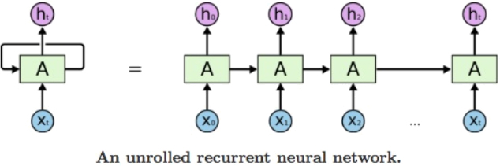

<style>
:root {
    --color-background: #FFFFFF !important;
	--color-foreground: #101010 !important;
    }

</style>

<!-- _class: lead -->

# Keras

---
<!-- paginate: true -->

# Ordre du jour
1. Introduction
2. Keras
3. Les réseaux neuronaux
4. Quelques exemples

---
# Introduction
## Que'est-ce que c'est Keras?
> "Keras est une **bibliothèque logicielle** open source qui fournit une interface Python pour les **réseaux de neurones artificiels**. Keras agit comme une interface pour la bibliothèque TensorFlow."

> "Jusqu'à la version 2.3, Keras prenait en charge plusieurs backends, notamment TensorFlow, Microsoft Cognitive Toolkit, Theano et PlaidML. A partir de la version 2.4, seul TensorFlow est pris en charge."

---
# Introduction
## Pourquoi Keras ?
- Réseaux récurrents (RNN) et réseaux convolutifs (CNN)
- Dilution (dropout), normalisation de batch et pooling
- Support pour GPU et TPU
- Support pour modèles en mode mobile (iOS et Android)

---
# Keras
## TensorFlow vs. Keras (rappel)

TF | Keras
-----|------
Générique (plusieurs tâches de ML) | Spécifique
Flexible | Intuitif
Utile pour faire de la recherche | Utile pour mettre un modèle en production

<br>
*Keras est compris dans le package TensorFlow pour Python

---
# Keras
## Functional API vs. Sequential API

- L'API Functional est plus flexible, mais plus difficile à utiliser.
- Pour une utilisation basique, l'API Sequential suffit.
- L'API Functional est nécessaire notamment pour
  - le partage de couches
  - inputs/outputs multiples

---
# Les réseaux neuronaux
## Le modèle de base


---
# Les réseaux neuronaux
## Le réseau de neurones récurrents (RNN)



- Plus utilisé pour "speech recognition" et "natural language processing" (NLP)

---
# Les réseaux neuronaux
## Le réseau de neurones convolutif (CNN)


- Plus utilisé pour reconnaissance d'images 

---
# Quelques exemples
## Les differents types de couches en Keras:
- Input: données d'entrée
- Dense: la couche "de base"
- Flatten: transforme les "arrays d'arrays" en 1 array
- Dropout: ignore un % des features d'entrée, pour éviter l'overfitting
- Conv2D: couche de convolution
- MaxPooling2D: 

---
# Quelques exemples
## Une couche de convolution

- Convolution: utiliser un kernel pour extraire des features d'un image.
- Cela nous permet d'identifier des formes plus ou moins simples (même des visages ou des objets)

---
# Quelques exemples
## Une couche de "pooling"

- Pooling: aggrégation de plusieurs pixels
- Cela rend le modèle plus robuste

---
# Quelques exemples
```py
model = keras.Sequential(
    [
        keras.Input(shape=input_shape),
        layers.Conv2D(32, kernel_size=(3, 3), activation="relu"),
        layers.MaxPooling2D(pool_size=(2, 2)),
        layers.Conv2D(64, kernel_size=(3, 3), activation="relu"),
        layers.MaxPooling2D(pool_size=(2, 2)),
        layers.Flatten(),
        layers.Dropout(0.5),
        layers.Dense(num_classes, activation="softmax"),
    ]
)

batch_size = 128
epochs = 15

model.compile(loss="categorical_crossentropy", optimizer="adam", metrics=["accuracy"])

model.fit(x_train, y_train, batch_size=batch_size, epochs=epochs, validation_split=0.1)
```
