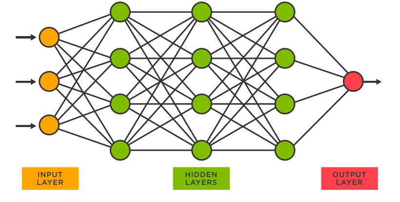

<style>
:root {
    --color-background: #FFFFFF !important;
	--color-foreground: #101010 !important;
    }

</style>

<!-- _class: lead -->

# TensorFlow

---
<!-- paginate: true -->

# Ordre du jour
1. Introduction
2. Rappel: les réseaux de neurones
3. TensorFlow
4. Quelques exemples

---
# Introduction
## Que'est-ce que c'est TensorFlow?
> "TensorFlow est une **plate-forme open source** de bout en bout pour **l'apprentissage automatique**. Il dispose d'un écosystème complet et flexible d'outils, de bibliothèques et de ressources communautaires qui permet aux chercheurs de pousser l'état de l'art en matière de ML et aux développeurs de créer et de déployer facilement des applications alimentées par ML"

---
# Introduction
## Que'est-ce que c'est TensorFlow?


---
# Introduction
## Pourquoi TensorFlow?
- Plusieurs niveaux d'abstraction
- Fait pour être mis en production sur n'importe quelle plateforme (mobile, etc.)

---
# Rappel: les réseaux de neurones
Un réseau de neurones c’est un type de modèle, inspiré du cerveau humain, composé de plusieurs équations plus ou moins simples, imbriquées

<br>


---
# Rappel: les réseaux de neurones
La façon dans laquelle ils sont imbriqués peut varier selon le problème

<br>



---
# TensorFlow
## Tenseurs, graphes et réseaux de neurones
- Un **tenseur** est un **conteneur** qui peut contenir des données en N dimensions
- Les tenseurs sont des généralisations de matrices à l'espace à N dimensions (une matrice est donc un tenseur spécifique, à 2 dimensions).

- TensorFlow permet la création d'un **flux de données**, en utilisant des **tenseurs** et des **graphes**.

- Nous pouvons donc utiliser **TensorFlow** pour construire un **réseau de neurones** !

---
# TensorFlow
## TensorFlow vs. Keras

TF | Keras
-----|------
Générique (plusieurs tâches de ML) | Spécifique
Flexible | Intuitif
Utile pour faire de la recherche | Utile pour mettre un modèle en production

<br>
*Keras est compris dans le package TensorFlow pour Python

---
# Quelques exemples
```py
import tensorflow as tf
# Define tensor constants.
a = tf.constant(2)
b = tf.constant(3)

mean = tf.reduce_mean([a, b])

# Matrix multiplications.
matrix1 = tf.constant([[1., 2.], [3., 4.]])
matrix2 = tf.constant([[5., 6.], [7., 8.]])
product = tf.matmul(matrix1, matrix2)

# Création d'un array avec 10 "0" ou "1" 
zeros = tf.zeros([10])
ones = tf.ones([10])

var_zeros = tf.Variable(zeros, name='zeros')

```

---
# Quelques exemples
```py
tf.nn.softmax(...)
tf.one_hot(...)
tf.clip_by_value(...)
tf.math.maximum(...)
tf.initializers.RandomNormal(...)
tf.nn.sigmoid(...)

```

---
# Quelques exemples
```py
def simple_neural_network(xb):
    # linéaire (1,2 @ 2,3 = 1,3)
    l1 = tf.matmul(xb, weights_1) + bias_1
    
    # non-linéaire
    l2 = tf.math.maximum(l1, tf.Variable([0.]))
    
    # linéaire (1,3 @ 3,1 = 1,1)
    l3 = tf.matmul(l2, weights_2) + bias_2
    return l3
```
